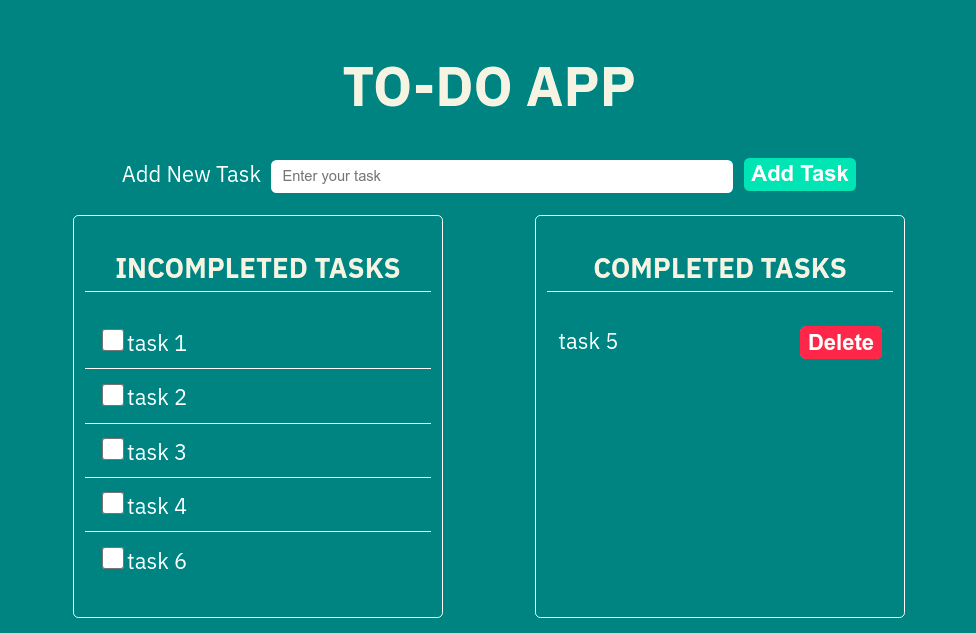

# todo-app
<p> A simple daily todo app</p>

<br>



## How to run 
1. Clone the repository

    ```sh
    git clone https://github.com/saiful-70/todo-app.git
    ```

2. Double click of __index.html__ to see output

## User guide
1. Fill the input field and click __Add Task__ button or click __Enter__ button to add a task
2. Clicking the __checkbox__ to ensure that task is completed and it will go through the __Completed Tasks__ 
3. Finally clicking the __delete__ button to clear the task permanently.
